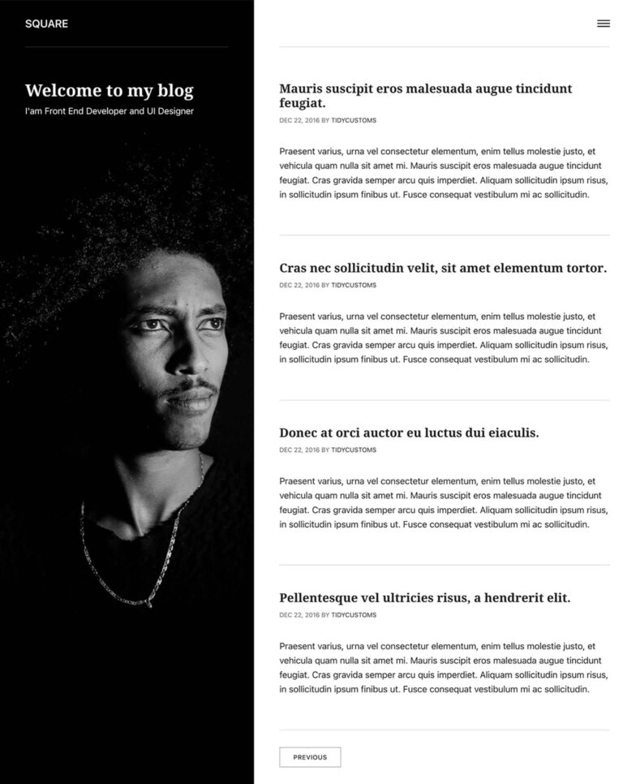

| ⚠️ | This repository is NOT affiliated with and/or endorsed by Publii in any way! This repo exists solely to share the (opinionated) modifications done to the original theme. Some of those modifications include bugfixes. Details on those are available [on the issue tracker](https://github.com/bvdbasch/square-publii-theme/issues)|
|:-:|:-|

# Square
The book-style layout, with hero image on the left and text on the right, is perfect for profiling your talents and experience, and it's all fully-responsive so smaller screens will still be able to read it comfortably without losing an of the smooth design.

## Standard features
> The available options may vary from theme to theme but they are mostly standardized.

Manage your page look and feel with extensive coloring, menu, social media sharing and layout options, or switch it up completely with one of our many unique themes.

+ Layout
+ Colors
+ Font size
+ Menu
+ Google Search
+ Share buttons
+ Disqus comments
+ GDPR cookies
+ Lazy load
+ Post options
